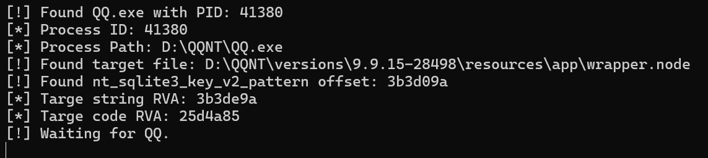
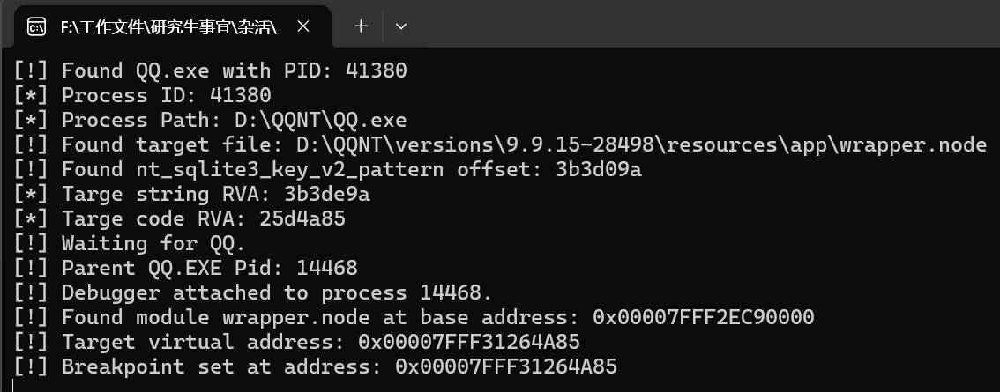
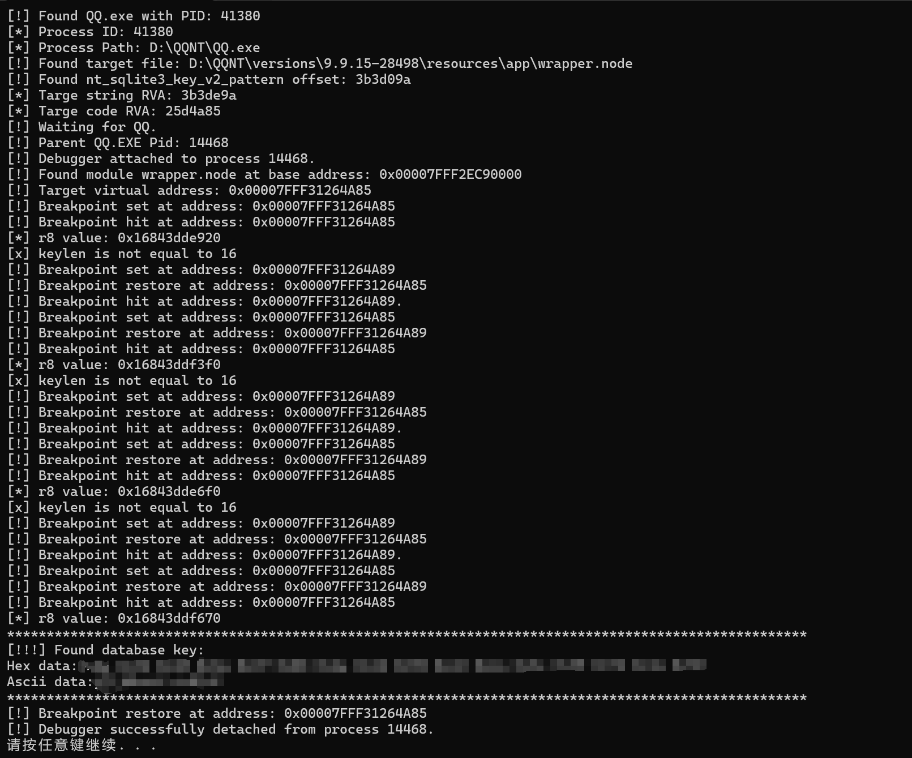

## QQ NT Windows数据库解密 

---

前两天才刚被腾讯强制更新，恰好更新成NTQQ了。一时兴起让我想要破解一下这个QQ的数据库密钥，参考了[教程 - NTQQ (Windows).md](https://github.com/QQBackup/qq-win-db-key/blob/master)。不过因为感觉每次都用调试器捣鼓半天不是很优雅，就花了一天时间集成了个可以直接跑的exe。

在9.9.15-28498版本上测试通过，这版本应该挺新的，刚更新的。

## 食用方法

---

因为一时兴起加上代码习惯吊差，代码风格多样，所以代码写的依托。所有的代码全部放在一个cpp里辣！所以不做代码解说了，下面给个演示过程。

1. 在QQ.exe（不需要登录）运行的情况下，运行QQDatabase.exe。此时会基于当前QQ的路径找到wrapper.node文件，然后基于特征定位到关键代码的RVA。此时会干掉QQ.exe，促使受害人重新打开QQ

2. 运行QQ.exe，工具会自动抓到一堆QQ.exe中那个父进程，然后attach上去，在关键代码处下断点。当看到breakpoint set的提示信息后就说明已经OK了

3. 登录QQ.exe，此时就会开始抓密钥了，捕捉的结果会写在下面打码的地方，同时还会输出一个password.txt的文件，里面存着ascii形式。

   程序运气好可能一次过，QQ还能正常登录使用。运气不好可能会卡一小会，还会导致QQ出现崩溃。不过崩溃原因我懒得查了，因为不管QQ崩不崩，反正总能拿到密钥，而且就是个兴趣使然，所以摆了。有兴趣的可以研究一下为啥是崩了，我猜可能是哪里同步没做好把。

4. 通过这个密钥可以解密数据库了，这个就不展示了，上面的友情链接里就有

